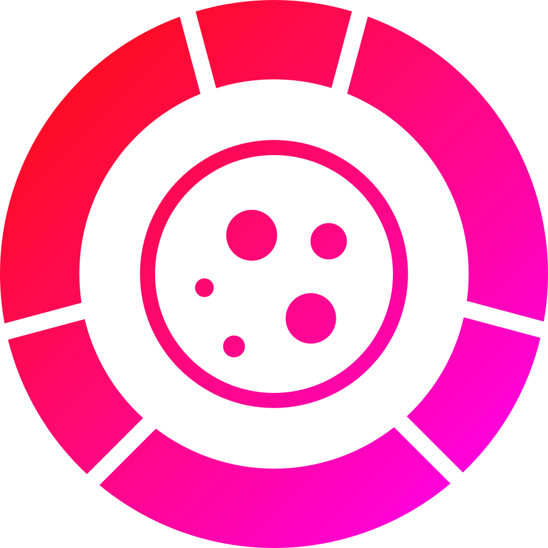

<div align="center">

  
  <h1>MoltenCore</h1>
  
  <p>
    The last Discord bot you'll ever need with Plugins and Dashboard
  </p>
  
  
<p>
  <a href="https://github.com/Stax124/MoltenCore/graphs/contributors">
    
  </a>
  <a href="">
    
  </a>
  <a href="https://github.com/Stax124/MoltenCore/network/members">
    
  </a>
  <a href="https://github.com/Stax124/MoltenCore/stargazers">
    
  </a>
  <a href="https://github.com/Stax124/MoltenCore/issues/">
    
  </a>
  <a href="https://github.com/Stax124/MoltenCore/blob/master/LICENSE">
    
  </a>
</p>
   
<h4>
    <a href="https://stax124.github.io/MoltenCore/">Documentation</a>
  <span> · </span>
    <a href="https://github.com/Stax124/MoltenCore/issues/new/choose">Report Bug</a>
  <span> · </span>
    <a href="https://github.com/Stax124/MoltenCore/issues/new/choose">Request Feature</a>
  </h4>
</div>

<br />

# 📔 Table of Contents

- [📔 Table of Contents](#-table-of-contents)
- [❗UNDER HEAVY DEVELOPMENT❗](#under-heavy-development)
  - [🌟 About the Project](#-about-the-project)
    - [📷 Screenshots](#-screenshots)
    - [🛰️ Tech Stack](#️-tech-stack)
    - [🎯 Features](#-features)
    - [🔑 Environment Variables](#-environment-variables)
  - [🧰 Getting Started](#-getting-started)
    - [🐳 Docker setup](#-docker-setup)
      - [Windows](#windows)
      - [Linux](#linux)
    - [🏃 Running locally](#-running-locally)
      - [🚩 Bot + Backend + Compiled frontend](#-bot--backend--compiled-frontend)
      - [🚩 Frontend in development mode](#-frontend-in-development-mode)
    - [🧪 Running Tests](#-running-tests)
  - [👋 Contributing](#-contributing)
    - [📜 Code of Conduct](#-code-of-conduct)
  - [⚠️ License](#️-license)
  - [🤝 Contact](#-contact)
  - [💎 Acknowledgements](#-acknowledgements)

# ❗UNDER HEAVY DEVELOPMENT❗

## 🌟 About the Project

### 📷 Screenshots

<div align="center"> 
  
</div>

### 🛰️ Tech Stack

<details>
  <summary>Client</summary>
  <ul>
    <li><a href="https://www.typescriptlang.org/">Typescript</a></li>
    <li><a href="https://vuejs.org/">Vue.js</a></li>
    <li><a href="https://www.naiveui.com/en-US/dark">NaiveUI</a></li>
    <li><a href="https://ionic.io/ionicons">Ionicons</a></li>
  </ul>
</details>

<details>
  <summary>Server</summary>
  <ul>
    <li><a href="https://www.python.org/">Python</a></li>
    <li><a href="https://fastapi.tiangolo.com/">FastAPI</a></li>
    <li><a href="https://sqlmodel.tiangolo.com/">SQLModel</a></li>
    <li><a href="https://alembic.sqlalchemy.org/en/latest/">Alembic</a></li>
  </ul>
</details>

<details>
<summary>Database</summary>
  <ul>
    <li><a href="https://www.postgresql.org/">PostgreSQL</a></li>
  </ul>
</details>

<details>
<summary>DevOps</summary>
  <ul>
    <li><a href="https://www.docker.com/">Docker</a></li>
    <li><a href="https://github.com/features/actions">GitHub Actions</a></li>
    <li><a href="https://pages.github.com/">GitHub Pages</a></li>
    <li><a href="https://vitepress.vuejs.org/">VitePress</a></li>
  </ul>
</details>

### 🎯 Features

- Install whatever plugins you want, no bloat
- Easy install with Docker
- Dashboard to manage your bot and plugins

### 🔑 Environment Variables

To run this project, you will need to add the following environment variables to your .env file

`DISCORD_BOT_TOKEN`

## 🧰 Getting Started

### 🐳 Docker setup

Copy just the docker-compose.yml and compose-alembic.ini to your project directory and run the following command

#### Windows

Use this to set the environment variable in powershell or create new environment variable in your system (this command will only work in powershell and is not persistent)

```powershell
$env:DISCORD_BOT_TOKEN=your_token
```

Run it

```powershell
docker-compose up -d
```

#### Linux

```bash
export DISCORD_BOT_TOKEN=your_token
sudo docker-compose up -d
```

### 🏃 Running locally

Clone the project

```bash
git clone https://github.com/Stax124/MoltenCore.git
```

Go to the project directory

```bash
cd MoltenCore
```

#### 🚩 Bot + Backend + Compiled frontend

Install dependencies

```bash
pip install poetry
poetry install
```

Start up the bot

```bash
poe start
```

<b>Or</b> if you want to help with development

```bash
poe dev
```

#### 🚩 Frontend in development mode

Change directory to frontend

```bash
cd frontend
```

Install dependencies

```bash
yarn install
```

Start the server

```bash
vite dev
```

### 🧪 Running Tests

To run tests, run the following command

```bash
poe test
```

## 👋 Contributing

<a href="https://github.com/Stax124/MoltenCore/graphs/contributors">
  
</a>

Contributions are always welcome!

See `contributing.md` for ways to get started.

### 📜 Code of Conduct

Please read the [Code of Conduct](https://github.com/Stax124/MoltenCore/blob/master/CODE_OF_CONDUCT.md)

## ⚠️ License

Distributed under the <b>MIT License</b>. See LICENSE for more information.

## 🤝 Contact

Tomáš Novák - tamoncz@gmail.com

Project Link: [https://github.com/Stax124/MoltenCore](https://github.com/Stax124/MoltenCore)

## 💎 Acknowledgements

- [Shields.io](https://shields.io/)
